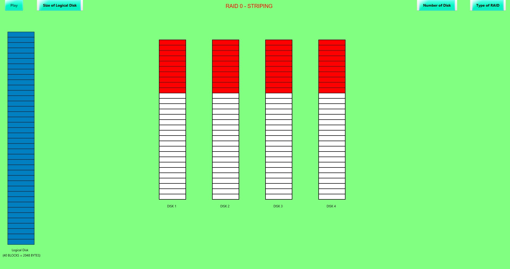

# RAID-SIMULATION
This project is about the data storage virtualization technology that  combines multiple physical disk drive components into one or more  logical units for the purposes of data redundancy, performance  improvement, or both. Technically, we were tasked to simulate  RAID levels 1 to 6 in its basic process. This project is written in Java  in which it utilizes the JavaFx as the GUI library used in this project.  This is in completion to the subject IT 155N – Introduction to  Operating Systems. 

## Preview of the GUI of RAID Applet

